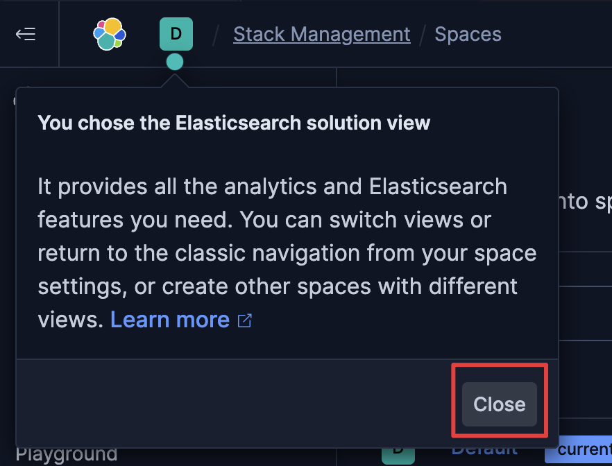
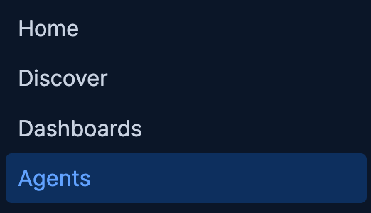
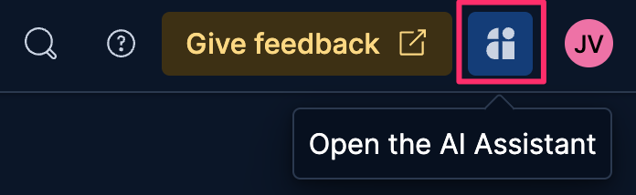
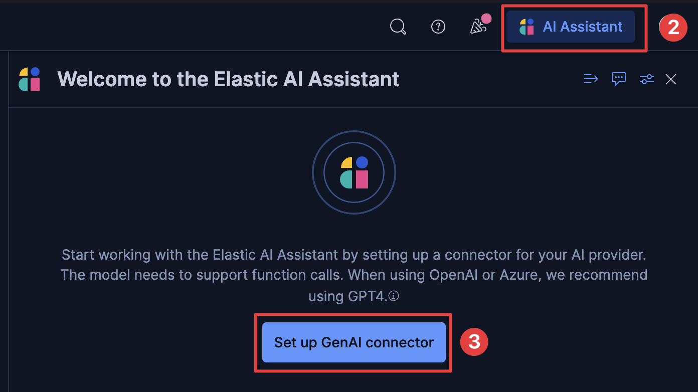
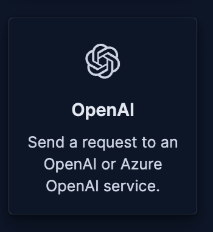
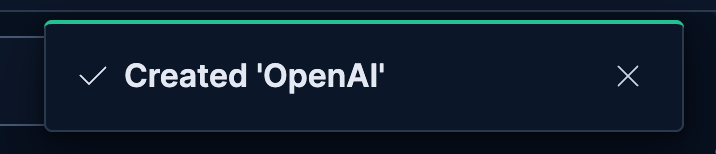
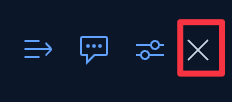
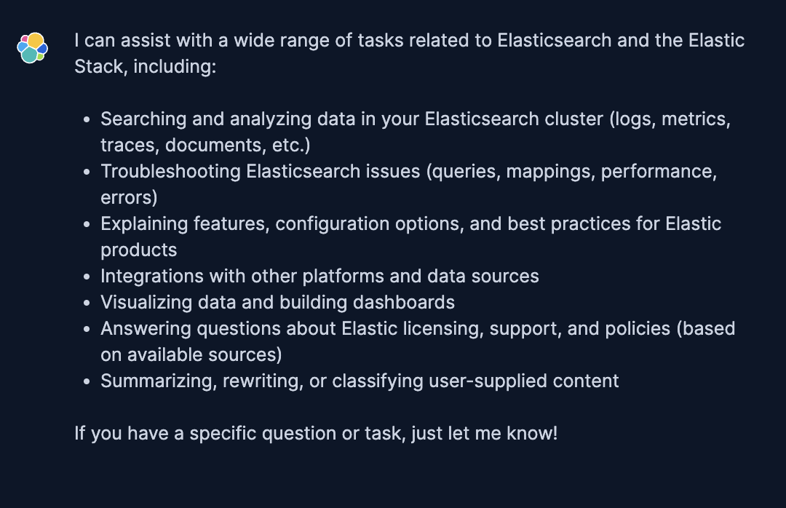

On this challenge you will:
- Configure the Chat Completion LLM connection
- Confirm you can Chat with Robots 🤖

> [!NOTE]
> Click `close` on the dialog box in the upper left
> 

Configure LLM Connector
==

1. Click on the [button label="Kibana - Chat"](tab-0) tab (`Agents` )

2. Click on the AI Assistant icon in the top right

3. Click on **Set up GenAI connector**

4. Click the **OpenAI** button

5. Fill out the form using the variable below, The API key is unique to you and vaild only for this workshop!
- Connector Name =>
```
OpenAI
```
- **URL** =>
```
[[ Instruqt-Var key="LLM_CHAT_URL" hostname="kubernetes-vm" ]]
```
- **Default model** =>
```
gpt-4.1
```
- Leave `OpenAI Organization` blank =>
```nocopy


```
- Leave  `OpenAI Project`  blank =>
```nocopy


```
   - **API Key** =>
```
[[ Instruqt-Var key="LLM_KEY" hostname="kubernetes-vm" ]]
```

7. Click Save
    - You will see a pop letting you know the connector was created
    
8. Click on the `X` or click off of the flyout to close the AI Assistant panel


Test Chat UI
==
You should still be in `Agents`  and see the Chat box

Lets see what our new Agent can do
```
What can you help with?
```
You should get a response similar to the screenshot below.

_click the image to enlarge_

We can check what data is loade in our cluster
```
What indices are available?
```

You can ask other questions but we'll move on to create specialised agents for out data.
