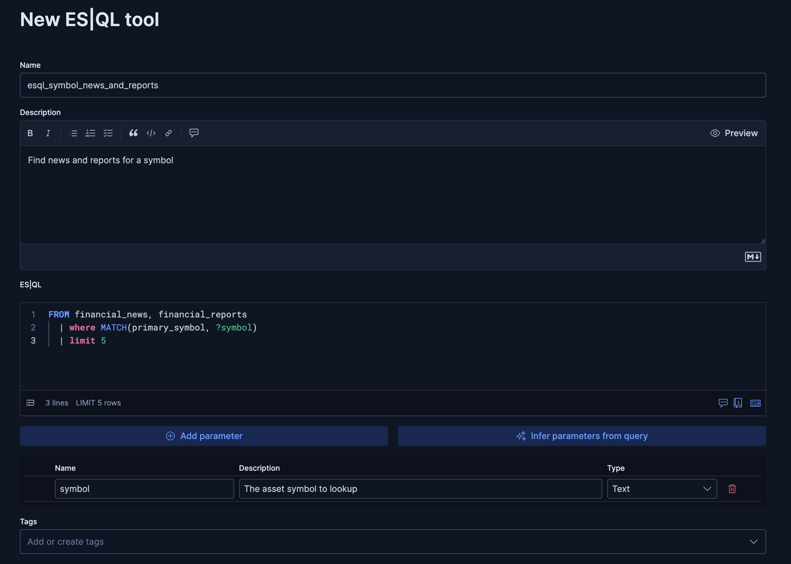
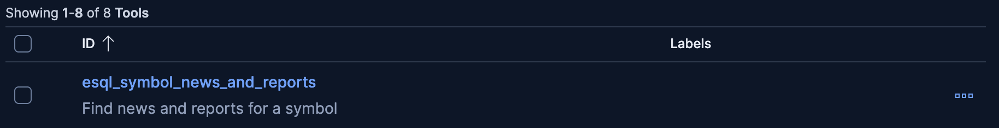

# On this challenge you will:
 Create new custom tools for our Chat agents to use.

---
## The Power of Custom Tools 🛠️
While our agent has access to general-purpose tools, creating custom tools for specific tasks makes it significantly smarter, faster, and more reliable.

Think of it like a Swiss Army Knife versus a specialized power tool. A general search tool is flexible, but the AI might need to use it multiple times, first exploring the data and then refining its query. A custom tool is designed to do one job perfectly in a single, efficient step.

By creating a specific tool, you reduce the number of steps the AI needs to reason through, leading to faster responses, lower costs (fewer LLM calls), and more accurate results.

---
# Create Your First Custom Tool
The first tool we will create will allow our agent to quickly find any news and reports about a specific symbol.

1. Click on [button label="Kibana - Tools"](tab-0) tab (Agents -> Tools)
2. Click on `New Tool`

3. under `Name` put:
```
esql_symbol_news_and_reports
```
4. Under `Description` put:
```
Find news and reports for a symbol
```
4. Give our tool a label so we can easily find groups of related tools
```
Finance
```
6. Under `ES|QL` put:
```
FROM financial_news, financial_reports
  | where MATCH(primary_symbol, ?symbol)
  | limit 5
```
6. Click on `Infer parameters from query`:


7. You should see a `symbol` entry. In the `description` box for that row put:
```
The asset symbol to lookup
```
8. Leave the `type` as
```nocopy
Text
```

- *click image to enlarge*

9. Click `Save`

You'll see a toast message letting you know the tool has been created


You'll also see our new tool in the tools list:

