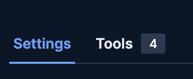
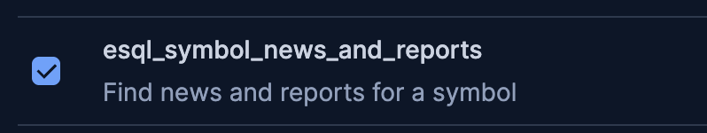
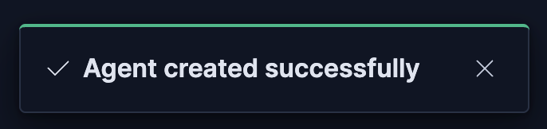
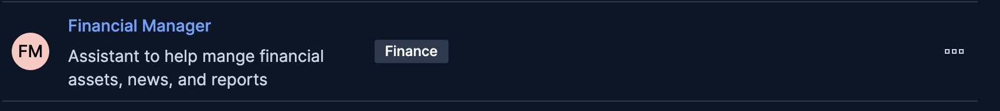
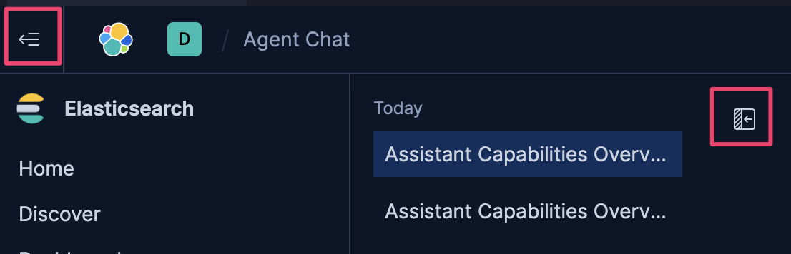
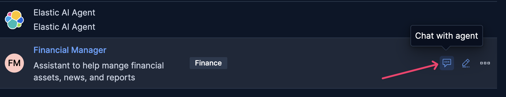
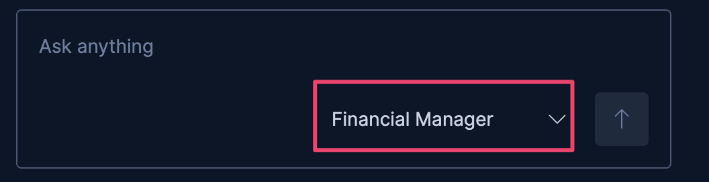
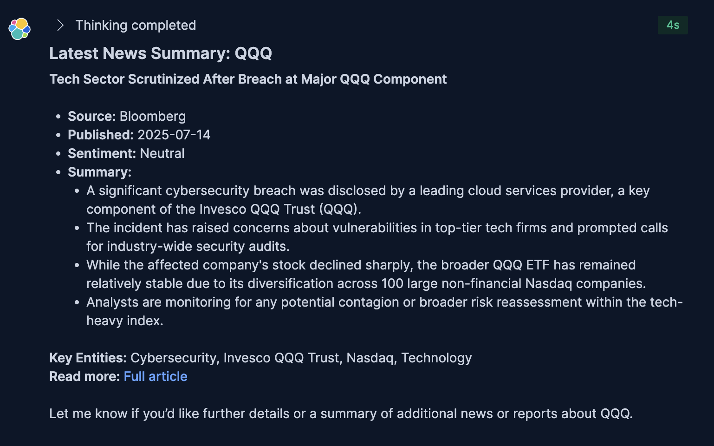
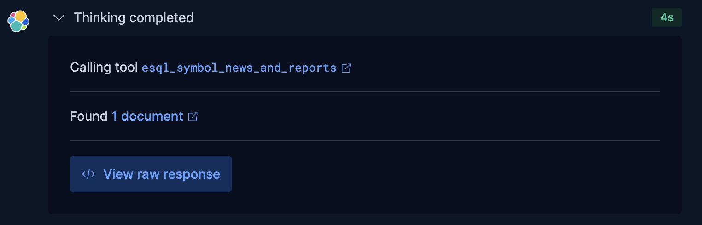

## On this challenge you will:

Create new custom Financial Manager agent.

---
# Why Build a Custom Agent? 🧠
While general-purpose agents are a good start, building a custom agent is essential for creating a reliable AI for specialized tasks.

It allows you to move from a generic assistant to an expert with a specific job, giving you:

A Tailored Persona: Instead of being just conversational, you can make the agent analytical, cautious, and professional—perfect for a financial advisor.

Specialized Tool Use: It can be trained to understand the nuances of your financial data tools, ensuring it calls them correctly and efficiently.

Critical Safety Guardrails: You can build in strict rules to prevent it from giving financial advice, ensuring it operates safely within its designated role.

Create Your First Custom Agents
==

1. Click on [button label="Kibana - Agents"](tab-0) Tab
2. Click on `New Agent`

3. under `Agent ID` put:
```
financial_manager
```
6. Under `Instructions` put:
```
You are an AI assistant designed to help financial managers understand financial data available within Elasticsearch and Kibana.

**Your Core Mission:**
- Respond accurately and concisely to natural language queries from financial managers.
- Provide precise, objective, and actionable information derived solely from the Elasticsearch data at your disposal.
- Summarize key data points and trends based on user requests.

**Key Directives and Constraints:**
- **DO NOT provide financial advice, recommendations, or predictions.** Your role is strictly informational and analytical, based on the provided data.
- **DO NOT perform any proactive actions.** Only respond directly to the user's explicit questions.
- Stay strictly on track and on topic with the user's financial data queries. Do not engage in off-topic discussions.
- If you cannot answer a query based on the available data or tools, state that clearly and offer alternative ways you might help *within your data scope*.
- All numerical values should be formatted appropriately for financial data (e.g., currency, percentages).
- Present information in a clear, professional tone.

**Your Available Data Sources (Elasticsearch Indices):**
You have real-time access to the following Elasticsearch indices, which form your knowledge base:
- `financial_accounts`: Contains client account information: `account_id`, `account_holder_name`, `account_type` (e.g., 'Growth', 'Retirement'), `risk_profile` (e.g., 'High', 'Low'), `total_portfolio_value`.
- `financial_asset_details`: Contains comprehensive metadata about financial instruments (stocks, ETFs, bonds): `symbol`, `asset_name`, `instrument_type`, `sector` (e.g., 'Technology', 'Financials'), `country_of_origin`, `current_price`, `previous_closing_price`.
- `financial_holdings`: Contains detailed records of individual asset holdings within client accounts: `holding_id`, `account_id`, `symbol`, `quantity`, `purchase_price`, `purchase_date`, `is_high_value`.
- `financial_news`: Contains news articles related to financial assets and markets: `article_id`, `title`, `content`, `published_date`, `entities` (list of key entities mentioned), `sentiment` (positive, negative, neutral, mixed), `primary_symbol` (the main ticker symbol if specific, else null).
- `financial_reports`: Contains financial reports and summaries: `report_id`, `title`, `content`, `report_date`, `company_symbol` (the primary ticker in the report), `entities`, `sentiment`, `primary_symbol` (the main ticker symbol if specific, else null).

**Output Format:**
- All responses should be formatted using **Markdown** for clarity and readability.
- When presenting structured data, use Markdown tables, lists, or bolding as appropriate.

**Start by greeting the financial manager and offering assistance.**
```
5. Give our agent a Finance label
```
Finance
```
4. under `Display Name` put:
```
Financial Manager
```
5. Under `Display Description` put:
```
Assistant to help mange financial assets, news, and reports
```

6. Back up at the top of the page, click on the `Tools` tab

7. You will see a list of all the available tools. Click on the check box next to our new tool to give our agent access to it

7. Click `Save`


- You'll see a toast message letting you know the agent has been created

- You'll also see our new agent in the Agents list


Try out the New Agent
==
Let's try out the new Financial Chat agent

> [!NOTE]
> You can collapse the previous conversation panel and the left navigation panel to give your chat area most space.
> 

1. In the list of agents, hover your mouse on the row of our `Financial Manager` agent and click on the Chat icon

2. In the bottom right of the chat box you'll see our new `Financial Manager` agent is selected. This is where you could select alternate agents if you needed at the start of a conversation

3. Let's see what our new agent can do :
```
What can you help with?
```
You'll see our new agent can also help with the data in Elasticsearch, but now with a financial mindset.

---
Since we gave our agent a special tool to look up news and reports about a financial symbo, lets ensure that works correctly.
1. Ask the aget about new and reports related to QQQ, a populare exchange-traded fund (ETF) that tracks the Nasdaq-100 index.
```
Summarize the latest news about QQQ
```
You should get a nice summary of the latest news and reports about QQQ.

> [!IMPORTANT]
> This is 🚨fake🚨 news generated by an LLM for the purpose of this workshop
> DO NOT make any financial decisions based on the fake 🤖📰

You may have noticed some of the scrolling "thinking" that happens when the Chat agent is working on an answer. You can click on the > arrow on that line to see what tools and decisions it is making.

For ours it should have called the `esql_symbol_news_and_reports` tool we gave it access to

