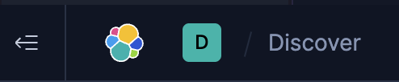
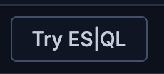
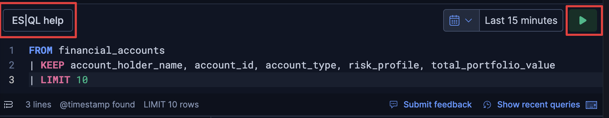
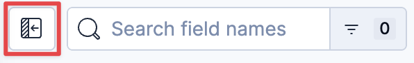
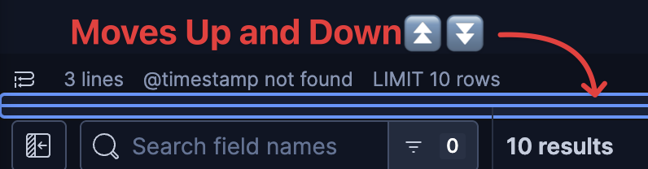
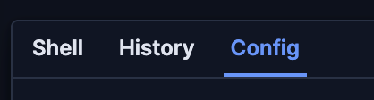
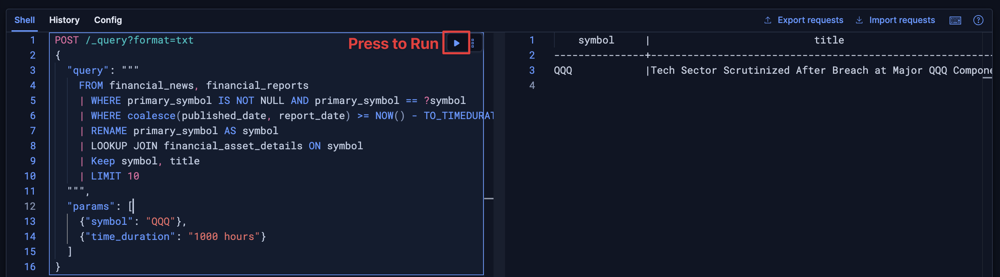
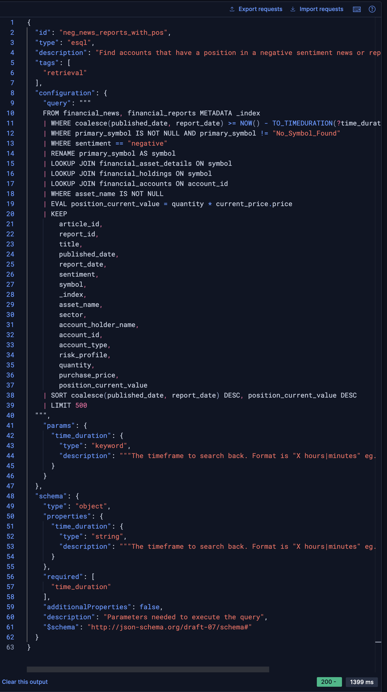

# A Quick Refresher on ES|QL

Welcome to the ESQL refresher! In this chapter, you'll learn the core syntax and commands of Elastic's powerful pipeline-oriented query language. We will use the financial data from this workshop to build a query, step-by-step, that finds specific news and reports and enriches them with asset details.

> [!NOTE]
> If you are an ES|QL expert feel free to skip this challenge, it will not affect the rest of the workshop

Part 0: Discover Setup
===
By default, Kibana's Discover still uses KQL (Kibana Query Language) for searching. However, we can change that!

1. Open the [button label="Kibana - Discover"](tab-0)
> [!NOTE]
> If you need more screen room, you can collapse the Kibana side bar by clicking on the left arrow
> 
2. Click on the `Try ES|LQ` button near the top of the page

3. Now you will see a larger entry box. To test it is working correctly enter this simple query:
```
FROM financial_accounts
| KEEP account_holder_name, account_id, account_type, risk_profile, total_portfolio_value
| LIMIT 10
```
4. Click the play button

You should see a table of 10 accounts and some of their information
> [!NOTE]
> Again, for more screen space, you can click the field collapse button to collapse field names

> You can also expand the text entry box for additional line space
>

Success 🎉Now continue on for a refresher in ES|QL basics.

Part 1: The Very Basics - `FROM`, `KEEP`, and `WHERE`
===

ESQL queries are a series of commands separated by a pipe (`|`). A query always starts with a `FROM` command, which specifies the data source (an index, data stream, or alias). From there, you can filter, enrich, and transform your data in a single pipeline.

## Example 1: `FROM` and `KEEP`
This query will pull documents from the `financial_news` index and keep only a few fields for us to see.

```esql
    FROM financial_news
    | KEEP article_id, title, published_date
    | LIMIT 5
````

1.  Paste the query above into the editor.
1.  Click the "Play" button to execute it. You should see a table with 5 news articles and their IDs, titles, and published dates.

Now, let's filter the results to find only news with a specific sentiment.

---
## Example 2: Filtering with `WHERE`

This query adds a `WHERE` command to filter the stream of data. For `keyword` fields like `sentiment`, ESQL uses `==` for an exact match.

```esql
    FROM financial_news
    | KEEP article_id, title, published_date, sentiment
    | WHERE sentiment == "negative"
    | LIMIT 5
```

1.  Paste the query above into the editor.
2.  You should now see a table of up to 5 news articles, all with a `sentiment` of `"negative"`.

Part 2: Working with Dates and Multiple Indices
===

A key feature of ESQL is its ability to easily handle time-based queries and combine data from multiple indices.

## Example 3: Combining Sources and Using Date Math

Let's modify our query to pull data from *both* the `financial_news` and `financial_reports` indices. We'll also add a `WHERE` clause to filter for documents from the last year.

  * `FROM financial_news, financial_reports`: This is how ESQL implicitly uses `UNION`s data.
  * `METADATA _index`: This is a crucial directive that makes the `_index` field available, allowing us to see which source each document came from.
  * `coalesce(published_date, report_date)`: A function that returns the first non-null date. This is useful when combining indices with different date field names.
  * `NOW() - TO_TIMEDURATION("7 hours")`: A date math expression that searches a time range between a year ago (8,760 hours) and now.

<!-- end list -->

```esql
    FROM financial_news, financial_reports METADATA _index
    | KEEP article_id, report_id, title, published_date, report_date, sentiment, _index
    | WHERE coalesce(published_date, report_date) >= NOW() - TO_TIMEDURATION("8760 hours")
    | WHERE sentiment == "negative"
    | LIMIT 50
```

1.  Paste the query above into the editor.
2.  You should see a mix of news articles and reports, all with negative sentiment and within the last year.
    - Note how `_index` is either `financial_news` or `financial_reports`, and either `article_id` or `report_id` (and their respective date fields) are populated.

Part 3: Enriching Data with `LOOKUP JOIN`
===

. `LOOKUP JOIN` allows us to enrich our data by combining it with documents from other indices. This is how we'll link our news and reports to asset metadata.

## Example 4: `LOOKUP JOIN` with a Single Source

Let's use a simple query to find a specific asset (`VXUS`) and enrich it with its details from the `financial_asset_details` index. Note that `LOOKUP JOIN` requires the joining indices to have `index.mode: "lookup"`.

  * `RENAME primary_symbol AS symbol`: This prepares our `primary_symbol` field to match the name of the join key (`symbol`) in the lookup index (`financial_asset_details`).
  * `LOOKUP JOIN financial_asset_details ON symbol`: This performs the join. After this command, fields from `financial_asset_details` (like `asset_name` and `sector`) become available in our query.

<!-- end list -->

```esql
    FROM financial_news METADATA _index
    | KEEP article_id, title, primary_symbol, published_date, sentiment
    | WHERE primary_symbol IS NOT NULL AND primary_symbol == "VXUS"
    | RENAME primary_symbol AS symbol
    | LOOKUP JOIN financial_asset_details ON symbol
    | KEEP article_id, title, symbol, asset_name, sector, published_date, sentiment
    | LIMIT 10
```

1.  Paste the query above into the editor.
2.  If `VXUS` news exists, you will see the news details alongside the `asset_name` and `sector` from the `financial_asset_details` index.

Part 4: Using ESQL Query Parameters
===
Let's move back to the API side and look at using parameters and then how to create a tool with the API.
- Open the [button label="Kibana - Console"](tab-1) to open up the Console
> [!NOTE]
> By default the Console will wrap the response output. This is usually helpful, but when the output is formatted in a table, it makes it difficult to read
> You can disable text wrapping by:
> 1. Click on `Config` in the Console
> 
> 2. Toggle Off `Wrap Long Lines`
> 
> 3. Click on `Shell` to return
>
> You will have to scroll to the right to see the full output, but the formatting will be easier to read.


---
In a production environment or when building reusable tools, it’s best practice to separate your query logic from the data you are filtering on. ES|QL query parameters allow you to do this, preventing injection attacks and making your queries more flexible.

## ESQL Query Parameter Syntax

  * **In the query string:** Use a question mark followed by the parameter name
      * e.g., `?symbol`, `?time_duration`
  * **In the request body:** Define a `params` object containing key-value pairs for each parameter.

This is what allows your tool to dynamically respond to user input without having to hardcode values.

```
POST /_query?format=txt
{
  "query": """
    FROM financial_news, financial_reports
    | WHERE primary_symbol IS NOT NULL AND primary_symbol == ?symbol
    | WHERE coalesce(published_date, report_date) >= NOW() - TO_TIMEDURATION(?time_duration)
    | RENAME primary_symbol AS symbol
    | LOOKUP JOIN financial_asset_details ON symbol
    | Keep symbol, title
    | LIMIT 10
  """,
  "params": [
    {"symbol": "QQQ"},
    {"time_duration": "1000 hours"}
  ]
}
```
1.  In the Kibana Dev Tools Console, copy and past the above ES|QL query with paramaters into the console
2. Hit the play button and you should see one result
    - The `params` object directly supplies values for the placeholders in the query string. In this example, the ESQL engine knows to replace `?symbol` with `"QQQ"` and `?time_duration` with `"1000 hours"`.


- _click to enlarge_

The Difference: ESQL Query vs. Agent Builder Tool Parameters
===

There is a slight difference between the ESQL query parameter syntax and the parameter syntax when defining an Agent Builder tool.

  * **ESQL Query Parameters (for the ES|QL engine):**
      * Uses the `?parameter` syntax and the `params` object in the `POST /_query` body.
  * **OneChat Tool Parameters (for the LLM agent):**
      * Uses the parameter definitions (`"type": "keyword"`, `"description": "..."`) in the `PUT kbn://api/chat/tools/...` request.
      * The LLM uses this metadata to decide if a tool is relevant and to infer the parameter values from a user's natural language question.

Part 5: Creating an ES|QL tool with the API
===
We'll explore the 1Chat APIs more in the next challenge, but lets finish up this ES|QL refresher section by creating a tool out of the query we've been learning about.

This is the full ES|QL query used in your demo's chat agent. It combines all the concepts we've covered, combining multiple sources, filtering a time duration, and chaining `LOOKUP JOIN`s to get a rich, correlated result set.

WIth a single command it will find accounts that have a position in a negative sentiment news or report in the specified timeframe

1. Run the below query in the Console to see a sample of results
    ```json
    POST _query?format=txt
    {
      "query": """
        FROM financial_news, financial_reports METADATA _index
        | WHERE coalesce(published_date, report_date) >= NOW() - TO_TIMEDURATION(?time_duration)
        | WHERE primary_symbol IS NOT NULL AND primary_symbol != "No_Symbol_Found"
        | WHERE sentiment == "negative"
        | RENAME primary_symbol AS symbol
        | LOOKUP JOIN financial_asset_details ON symbol
        | LOOKUP JOIN financial_holdings ON symbol
        | LOOKUP JOIN financial_accounts ON account_id
        | WHERE asset_name IS NOT NULL
        | EVAL position_current_value = quantity * current_price.price
        | KEEP
            article_id,
            report_id,
            title,
            published_date,
            report_date,
            sentiment,
            symbol,
            _index,
            asset_name,
            sector,
            account_holder_name,
            account_id,
            account_type,
            risk_profile,
            quantity,
            purchase_price,
            position_current_value
        | SORT coalesce(published_date, report_date) DESC, position_current_value DESC
        | LIMIT 50
      """,
      "params": [
        {
          "time_duration": "3650 hours"
        }
      ]
    }
    ```

2. Now lets actually create a tool with our new ES|QL query. Paste and run the following `PUT` request. This will register the full query with the MCP server.

    ```json
    POST kbn://api/agent_builder/tools
    {
      "id": "neg_news_reports_with_pos",
      "type": "esql",
      "description": "Find accounts that have a position in a negative sentiment news or report in the specified timeframe.",
      "configuration": {
      "query": """
        FROM financial_news, financial_reports METADATA _index
        | WHERE coalesce(published_date, report_date) >= NOW() - TO_TIMEDURATION(?time_duration)
        | WHERE primary_symbol IS NOT NULL AND primary_symbol != "No_Symbol_Found"
        | WHERE sentiment == "negative"
        | RENAME primary_symbol AS symbol
        | LOOKUP JOIN financial_asset_details ON symbol
        | LOOKUP JOIN financial_holdings ON symbol
        | LOOKUP JOIN financial_accounts ON account_id
        | WHERE asset_name IS NOT NULL
        | EVAL position_current_value = quantity * current_price.price
        | KEEP
            article_id,
            report_id,
            title,
            published_date,
            report_date,
            sentiment,
            symbol,
            _index,
            asset_name,
            sector,
            account_holder_name,
            account_id,
            account_type,
            risk_profile,
            quantity,
            purchase_price,
            position_current_value
        | SORT coalesce(published_date, report_date) DESC, position_current_value DESC
        | LIMIT 500
      """,
      "params": {
        "time_duration": {
          "type": "keyword",
          "description": """The timeframe to search back. Format is "X hours|minutes" eg. "7 hours" """
        }
      }
      },
     "tags" : ["retrieval"]
    }
    ```
You should see a response with information about our new tool:

- _click to enlarge_

We'll explore more about the Agentic APIs in the next section
