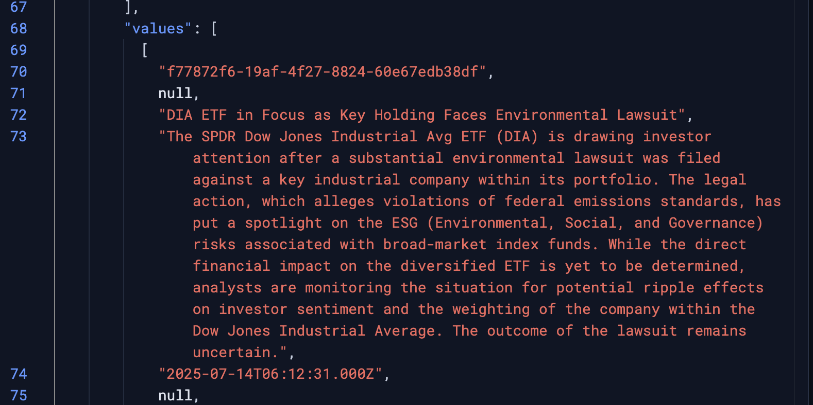
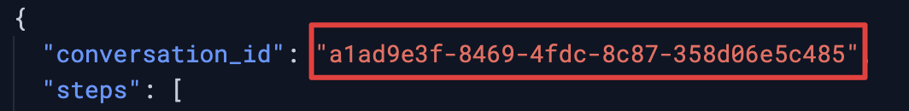
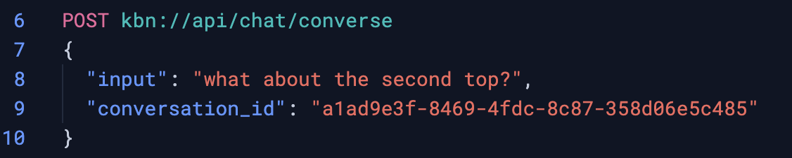
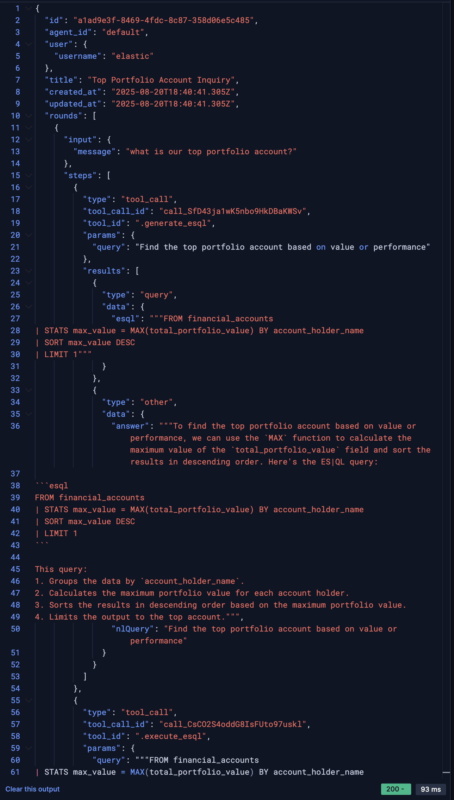

On this challenge you will:
- Learn about the `Tools` API
- Learn about the `Agents` API
- Learn about the `Converse` API


Overview
===
Agent Builder offers a suite of APIs to power a conversational AI experience, allowing users to interact with their data through natural language.

These APIs are designed to be extensible, enabling developers to create custom tools and agents. The core of the platform is built around three main API paths:
- The Tools API path is
  - `/api/agent_builder/tools`
- The Agents API path:
  - `/api/agent_builder/agents`
- The Chat, or Converse, path:
  - `/api/agent_builder/converse`

Let's explore each API in more detail.

---
As we'll be working with the API, ensure you are in the [button label="Kibana - Console"](tab-0) tab.

We will run all the below commands in the Console.

Tools API
===
The Tools API path `/api/agent_builder/tools` allows for the management of "tools," which are essentially functions that an AI agent can use to perform specific actions or retrieve information. These tools can range from simple data retrieval to more complex operations. A key feature is the ability to create custom tools using ES|QL, allowing for tailored interactions with your data.

# List available tools
First, lets look at how we can list the tools that are already created:
1. Enter the `GET` below and run it
```
GET kbn://api/agent_builder/tools
```

### Tool Object Fields

Here are the main keys you'll find in each tool object:

* **`id`**: This is the unique identifier for the tool. When an agent decides to use a tool, it will refer to it by this name (e.g., `.get_document_by_id`, `esql_symbol_news_and_reports`).

* **`type`**: This field specifies the kind of tool it is. In your example, you have two types:
    * **`builtin`**: These are standard, pre-defined tools that come with 1Chat. They provide core functionalities like searching, listing indices, or retrieving documents.
    * **`esql`**: This indicates a custom tool that you define yourself using an **ES|QL (Elasticsearch Query Language)** query. This allows you to create highly specific tools tailored to your own data.

* **`description`**: This is a crucial field. It's a natural language description of what the tool does. The AI model uses this description to understand when it should use this particular tool to answer a user's question.

* **`configuration`**: This object contains the specific logic for the tool.
    * For **`builtin`** tools, this is usually an empty object `{}` because their logic is pre-compiled into the system.
    * For **`esql`** tools, this is where the magic happens. It contains the `query` to be executed and a `params` object that defines the variables the user can pass into that query. For example, in the `esql_symbol_news_and_reports` tool, the query is defined, and it expects a `symbol` parameter.

* **`schema`**: This defines the input parameters that the tool requires to run. It's written in **JSON Schema**, a standard way to describe the structure of JSON data. The AI uses this schema to understand what information it needs to ask the user for or extract from the conversation before it can execute the tool. The schema object itself contains several important keys:
    * **`type`**: Always `"object"` for tool parameters.
    * **`properties`**: This is a dictionary where each key is a parameter name (e.g., `id`, `index`, `query`). The value is another object describing that parameter's type (`string`, `number`, `array`) and a `description`.
    * **`required`**: An array of strings listing which of the properties are mandatory for the tool to run. For example, the `.get_document_by_id` tool requires both an `id` and an `index`.
    * **`additionalProperties`**: Typically set to `false`, this means the tool will not accept any parameters that are not explicitly defined in the `properties` object.

---
# Create a Tool using the API
We've seen how to create a custom tool through the UI, and we created a tool using the API in the ES|QL section. But now that we've explained more, let's create one more tool with the API.

1. Paste and run the following code to create the first tool through the API:
    Create ES|QL find News and Reports for a Symbol within a time range
```json
POST kbn://api/agent_builder/tools
{
  "id": "news_and_report_lookup_with_symbol_detail",
  "type": "esql",
  "description": "Find News and Reports about a specific Symbol. Includes detail about the Symbol.",
  "configuration": {
    "query": """
        FROM financial_news, financial_reports METADATA _index
        // Keep relevant fields from both news and reports, including primary_symbol
        | KEEP article_id, report_id, title, content, published_date, report_date, primary_symbol, sentiment, _index, company_symbol

        // Filter by timeframe
        | WHERE coalesce(published_date, report_date) >= NOW() - TO_TIMEDURATION(?time_duration)

        // FIX: Filter for a SINGLE specific symbol from a parameter.
        | WHERE primary_symbol IS NOT NULL AND primary_symbol != "No_Symbol_Found" AND primary_symbol == ?symbol

        // Sentiment filter removed as it doesn't matter for this query
        // | WHERE sentiment == "negative"

        // RENAME 'primary_symbol' to 'symbol' for consistent joining with asset_details
        | RENAME primary_symbol AS symbol

        // Join with financial_asset_details to get asset-specific metadata (name, sector, country)
        | LOOKUP JOIN financial_asset_details ON symbol

        // Removed all joins to financial_holdings and financial_accounts

        // Select the final set of fields (news/report data + asset details ONLY)
        | KEEP
            article_id, report_id, title, content,
            published_date, report_date,
            sentiment, symbol, _index,
            asset_name, instrument_type, sector, country_of_origin ,
            current_price.price, current_price.last_updated

        // Sort the results by the most recent date
        | SORT coalesce(published_date, report_date) DESC

        // Limit the number of results
        | LIMIT 500
      """,
    "params": {
      "time_duration": {
        "type": "keyword",
        "description": """The timeframe to search back. Format is "X hours|minutes|days" eg. "7 hours" """
      },
      "symbol": {
        "type": "keyword",
        "description": """The financial symbol to look up. eg "ESTC" """
      }
    }
  },
  "tags": [
    "retrieval"
  ]
}
```

The commented lines above `// comment` are optional but should help you understand what each line of the query is doing.

This is very similar to the one we created in the last step, but adds a symbol restriction, allowing the agent to reduce the results by one symbol, which should speed up the response.

This new tool, along with the other tools, will be available through the `tools` API, but also exposed as a tool when MCP clients connect to this MCP Server 🤖

---
# Calling a Tool Directly
While agents typically choose which tool to use, you can also execute a specific tool directly via the Tools API. This is useful for testing or for programmatic workflows where you know exactly which tool you need to run.

You do this by making a `POST` request to the tool's `_execute` endpoint, providing the necessary parameters in the body.

```json
POST kbn://api/agent_builder/tools/_execute
{
  "tool_id": "news_and_report_lookup_with_symbol_detail",
  "tool_params": {
   "symbol": "DIA",
	 "time_duration": "5000 hours"
  }
}
```

You should see the output of the tool call:

- _partial output_

Agents API
===
The Agents API path `/api/agent_builder/agents` is used to manage "agents," which are configurable personas that handle conversations. You can define an agent's instructions, personality, and the specific set of tools it's allowed to use to answer user queries. This allows for the creation of specialized agents for different tasks or domains.
# List Available Agents
1. Run the GET request to list all current Agents
    ```
    GET kbn://api/agent_builder/agents
    ````

### Agent Object Fields

* **`id`**: This is the **unique identifier** for the agent, like `default` or `financial_manager`. You use this ID to specify which agent you want to interact with when you call the chat API.

* **`type`**: This defines the agent's type. In this case, it's a **`chat`** agent, meaning it's designed for conversational interactions.

* **`name`**: This is a **human-readable name** for the agent that might be displayed in a user interface, such as "Onechat default agent" or "Financial Manager".

* **`description`**: This provides a **brief summary** of the agent's purpose, helping users understand what it's designed to do at a glance.

* **`configuration`**: This is the most important part—it defines how the agent behaves. It's an object that contains two key settings:
    * **`instructions`**: This is a detailed prompt that gives the AI model its **personality, rules, and context**. It can define the agent's mission, constraints (like "DO NOT provide financial advice"), available data sources, and required output format (like Markdown). The `default` agent has no special instructions, but the `financial_manager` has a very detailed set of rules that governs its responses.
    * **`tools`**: This is an array that specifies **which tools the agent is allowed to use**. You can grant access to tools in a few ways:
        * Giving it a single tool by its `id`, like `"esql_symbol_news_and_reports"`.
        * Granting it access to all built-in tools with `{"type": "builtin", "tool_ids": ["*"]}`.
        * Granting it access to *all* tools (both built-in and custom) with `{"tool_ids": ["*"]}`, as seen in the `default` agent.

---
# Create a New Agent
Let's create a new agent with a narrow scope.

1. Run the POST command below
    ```json
    POST kbn://api/agent_builder/agents
     {
      "id": "financial_news_agent",
      "name": "Financial News Agent",
      "description": "An agent focused on providing news and reports as they relate to financial positions.",
      "configuration": {
        "instructions": "You are a specialized AI assistant that provides financial news and reports for specific assets. Your only job is to use the available tools to find news and reports when a user asks about a financial symbol. Present the information clearly in      Markdown format. Do not answer questions outside of this scope or perform any other tasks.",
        "tools": [
          {
              "tool_ids": [
                "esql_symbol_news_and_reports"
              ]
            }
          ]
        }
      }
    ```
This command creates a new agent named `Financial News Agent`.

It is specifically instructed to
- Focus only on news and reports
- Is given access to just the single custom tool, `esql_symbol_news_and_reports`, that retrieves this information.

---
# GET Info About our new Agent
We already learned how to get info about all agents, but you can get info about one specific agent by specifying the agent in the path
```json
GET kbn://api/agent_builder/agents/financial_news_agent
```

Converse API
===
The Chat, or Converse, path `/api/agent_builder/converse` is the primary endpoint for interacting with the agents. This API powers the chat interface, managing the conversation flow and leveraging the configured agents and tools to provide answers to user questions.

Follow along by running each of the code samples below to learn how the Converse API works.

---
# Start a New Conversation
To begin a new chat, you send your initial question to the `converse` endpoint. This will start a new conversation thread with the **default** agent.

```json
POST kbn://api/agent_builder/converse
{
  "input": "what is our top portfolio account?",
	"agent_id": "financial_news_agent"
}
```

### Conversation Response Body Fields
When you start a new conversation, the response body shows you both the final answer and the "work" the agent did to get there. Let's break down the main components.

* **`conversation_id`**: This is the unique ID for this specific chat session. You will include this ID in any follow-up questions to maintain the context of the conversation.

* **`steps`**: This is an array that shows the agent's step-by-step reasoning. It's essentially a log of the actions the agent took. In this example, it contains a single step:
    * **`type: "tool_call"`**: This indicates that the agent's action was to use a tool.
    * **`tool_id: ".nl_search"`**: This tells you *which* tool the agent chose to use based on your input. Here, it used the natural language search tool.
    * **`params: { "query": "top portfolio account" }`**: These are the parameters the agent sent to the tool. It translated your question into a query the tool could understand.
    * **`result: "..."`**: This is the raw, structured data (in this case, a JSON string) that the tool returned after executing. This is the data the agent will use to form its final answer.

* **`response`**: This object contains the final, human-readable answer that gets displayed to the user.
    * **`message: "The top portfolio..."`**: This is the natural language response formulated by the agent after interpreting the `result` from the tool call. It takes the raw data and presents it in a clear, easy-to-understand sentence.
-----
# Ask a Follow-up Question
To continue the same conversation, you include the `conversation_id` from the previous response. It will be similar to the screenshot (but not exactly the same ID)


Elastic's Agentic platform has built-in "memory". By providing the `conversation_id` you give the agent the context of the chat history.

Copy the `conversation_id` from the first response, and add it to the below command before running it:
```json
POST kbn://api/agent_builder/converse
{
  "input": "what about the second top?",
  "conversation_id": "<REPLACE WITH ACTUAL ID FROM PREVIOUS STEP>"
}
```


Your code will use the same `conversation_id` throughout the conversation to continue context.

-----
# Talk to a Specific Agent

If you want to talk to a specialized agent instead of the default one, you can specify its ID using the `agent_id` field.

```json
POST kbn://api/agent_builder/converse
{
  "input": "What news about DIA?",
  "agent_id": "financial_news_agent"
}
```

-----
# List Your Conversation History
To see a list of all the conversation threads you've had, you can make a `GET` request to the `conversations` endpoint.

```http
GET kbn://api/agent_builder/conversations
```

-----
# Retrieve a Full Conversation

To get all the messages, tool outputs, and other details from a single chat, you can use a `GET` request with the specific `conversation_id`.

Just like earlier, copy the `conversation_id` from the first response, and add it to the below command before running it:
```http
GET kbn://api/agent_builder/conversations/<REPLACE WITH ONE ACTUAL ID FROM PREVIOUS STEP>
```
e.g.:
- 

You'll see the conversation for that ID



Click `Next` to continue.
